# Numi 设计风格文档

版本：0.1  
日期：2026-06-18  
参考对象：Cookie 记账 iOS 手机 App  
适用范围：Numi 纯本地记账 App、后续同审美体系 App、原生 iOS 或 Flutter 基础 UI 组件库

## 1. 调研说明

本文件基于公开可访问的 Cookie 记账 iOS 手机页面素材进行设计拆解。素材来源包括 App Store 当前 iPhone 截图与公开评测页实机截图。App Store 截图带设备壳和营销背景，适合分析页面结构、色彩倾向和组件模式；若要做像素级还原，后续应使用真机内屏截图复核尺寸。

设计目标不是复制 Cookie 的品牌、资产或页面，而是提炼其“轻、快、温和、低压”的移动记账体验，并沉淀为 Numi 可复用的本地优先设计系统。本文档的规范单位以 iOS point / Flutter logical pixel 表达；在 1x 逻辑坐标中两者可按同一数值使用，最终由平台渲染到实际像素。

## 2. 竞品截图索引

以下截图均已保存到仓库，后续实现与评审可直接引用。至少覆盖 10 个不同页面或功能状态。

| 编号 | 页面/状态 | 来源 | 本地图片 |
| --- | --- | --- | --- |
| 01 | 明细首页、月度概览、记录列表、底部导航、悬浮记账 | App Store | 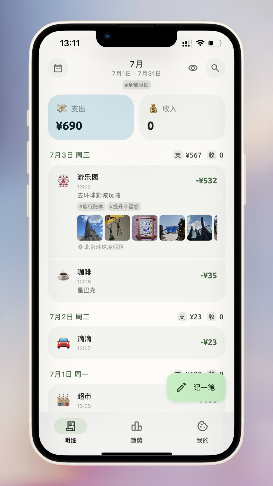 |
| 02 | 快速记账、分类网格、金额键盘、底部操作 | App Store | 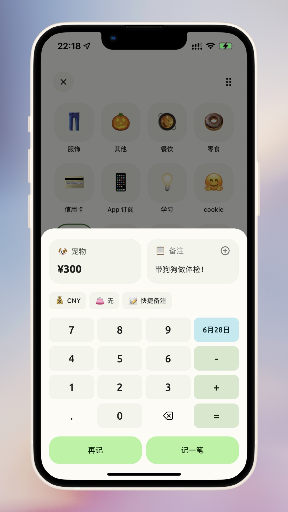 |
| 03 | 趋势页、月概览、支出分布、进度条图表 | App Store | 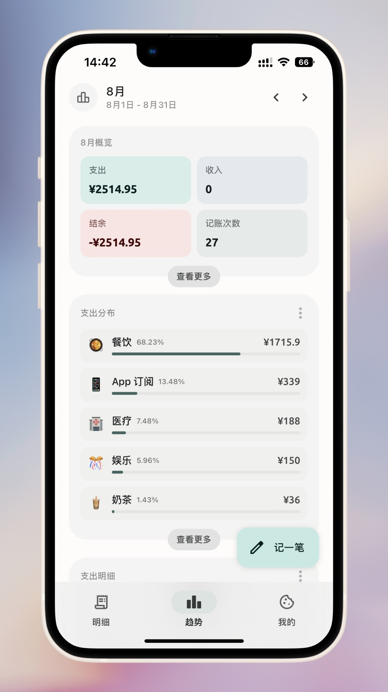 |
| 04 | 订阅与分期、深色模式、分组列表 | App Store | 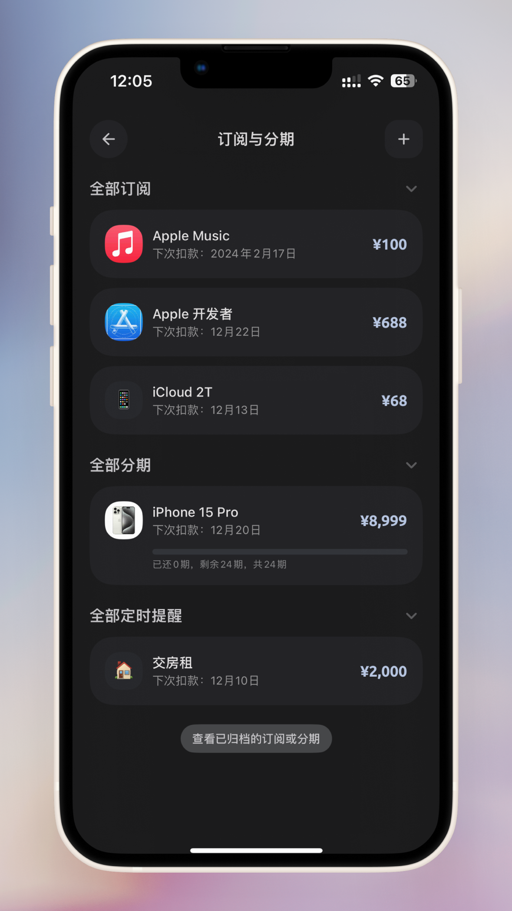 |
| 05 | 桌面小组件/状态组件展示 | App Store | 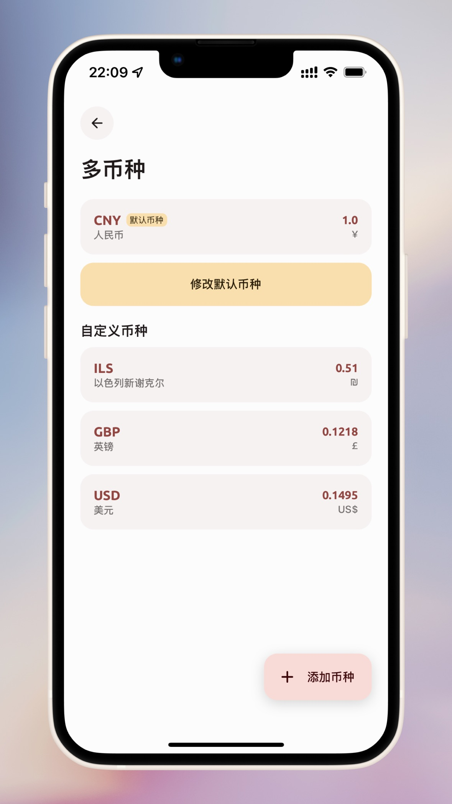 |
| 06 | AI 记账/智能录入宣传页 | App Store | 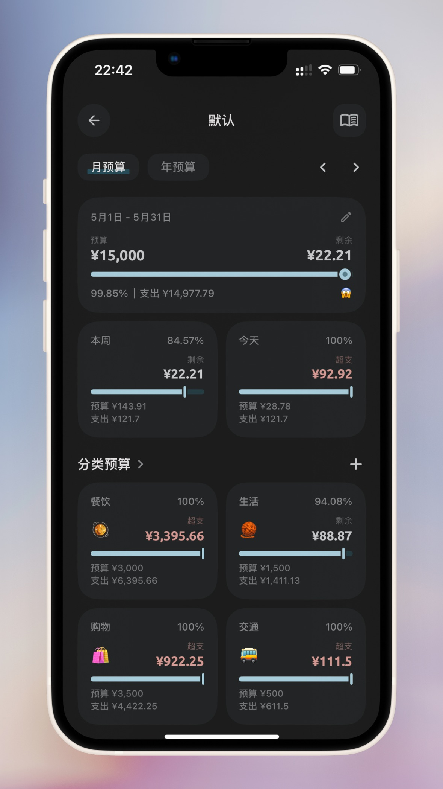 |
| 07 | 多主题/外观个性化展示 | App Store | 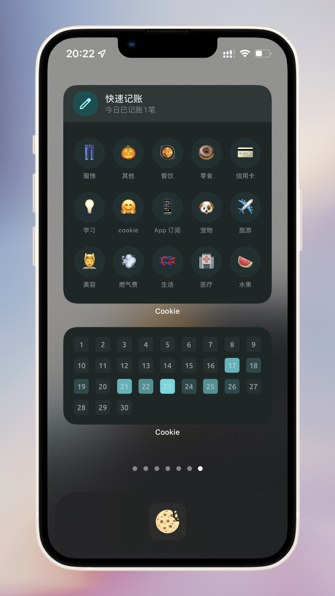 |
| 08 | 资产/多币种/跨设备能力展示 | App Store | 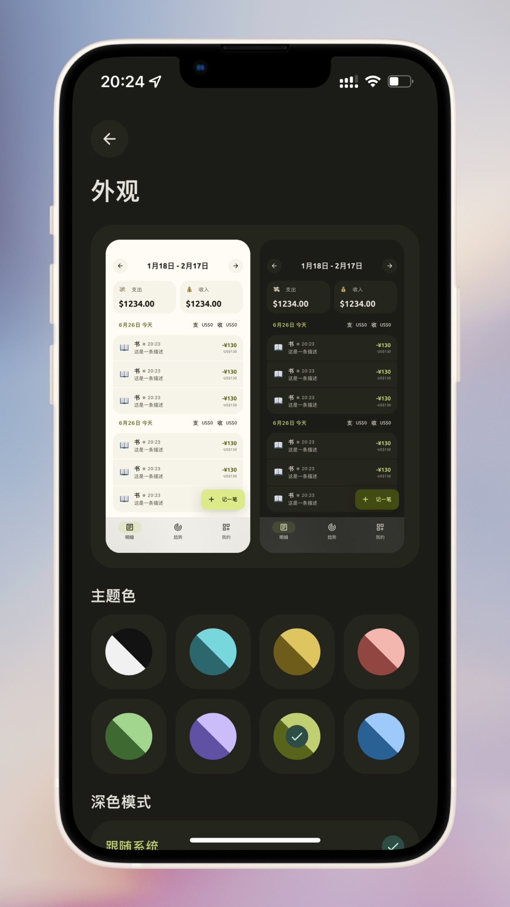 |
| 09 | 日历明细/单日账单实机页面 | 公开评测 | 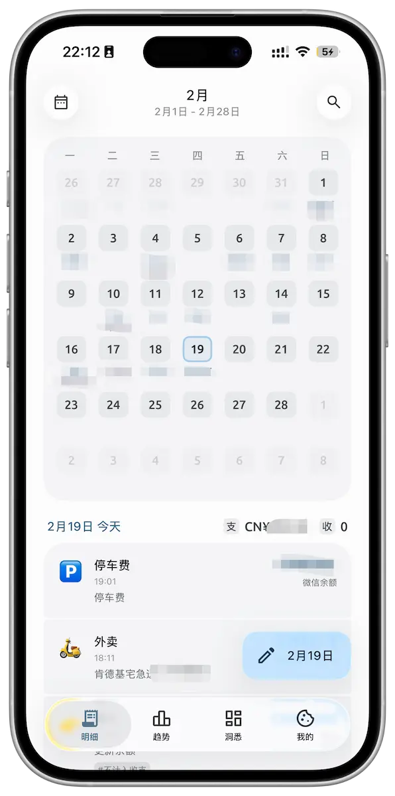 |
| 10 | AI 识别后编辑账单页面 | 公开评测 | 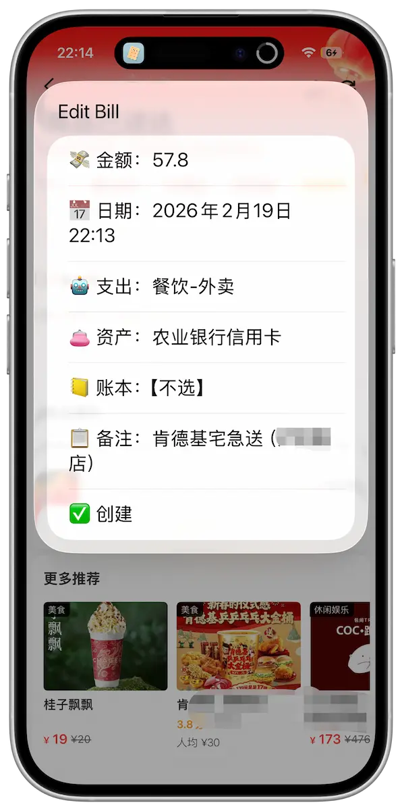 |
| 11 | 订阅、分期、定时提醒实机页面 | 公开评测 | 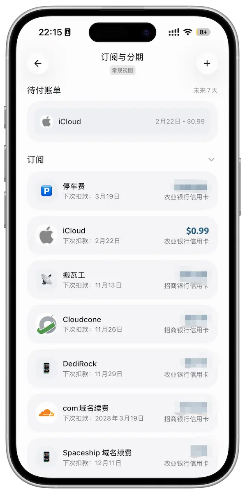 |
| 12 | 版本历史/更新记录页面 | 公开评测 | 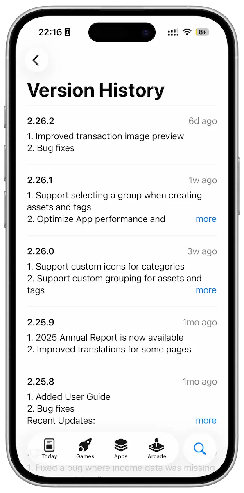 |
| 13 | 我的/功能入口列表页面 | 公开评测 | 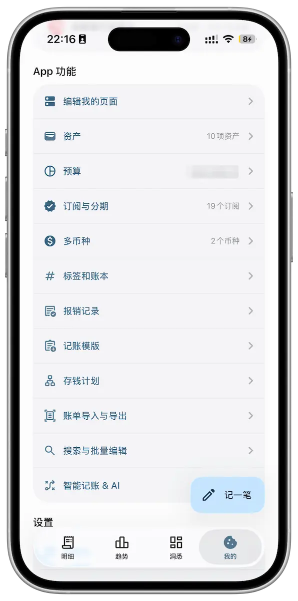 |

参考链接：

- [Cookie 记账 App Store 中国区](https://apps.apple.com/cn/app/cookie-%E8%AE%B0%E8%B4%A6/id1559943673)
- [iTunes Lookup API](https://itunes.apple.com/lookup?id=1559943673&country=cn)
- [公开评测页：Cookie，给你一点记账的小小震撼](https://veryjack.com/technique/cookie/)

## 3. 风格定位

### 3.1 关键词

- 轻：减少装饰和页面噪音，让账单数据成为主体。
- 快：所有高频动作都要一眼可见、一步可达、反馈直接。
- 软：低饱和色、浅背景、柔和圆角、弱阴影。
- 准：金额、日期、分类、账户和状态必须清晰。
- 可亲近：允许 Emoji、柔和色块和轻松语气，但不牺牲财务严谨性。

### 3.2 Numi 的差异化表达

Cookie 更强调“好看、方便、AI、iCloud、多端”。Numi 应强调：

- 本地可信：不登录也完整可用，数据在本机。
- 安静克制：不做开屏、广告、理财入口。
- 可复用审美：把视觉规则做成 token 和组件库。
- 稳定长期：适合多年账本积累，不追热点视觉。

### 3.3 设计禁区

- 不复制 Cookie 的品牌名、图标、营销语、截图构图。
- 不使用过度拟物或强烈金融红绿。
- 不让页面充满卡片嵌套。
- 不把 App 做成单一薄荷绿、单一蓝灰或单一米色主题。
- 不在核心工具页使用落地页式大标题和宣传文案。

## 4. 信息架构与页面骨架

## 4.0 平台实现策略

Numi 后续可能使用原生 iOS 或 Flutter 实现。设计系统必须先定义平台无关的 token 和组件语义，再分别映射到 SwiftUI/UIKit 或 Flutter Widget，避免后续换技术栈时重做审美。

### 4.0.1 推荐路线

| 方案 | 适用情况 | 推荐程度 | 说明 |
| --- | --- | --- | --- |
| SwiftUI 为主，UIKit 补位 | 只做 iOS，重视系统质感、Widget、Watch、Shortcuts、Face ID、iCloud 可选能力 | 高 | 更接近 Cookie 的 iOS 原生触感，系统能力接入自然 |
| UIKit 为主 | 团队已有 UIKit 经验，列表性能和复杂输入控制要求极高 | 中 | 可控性强，但组件开发成本更高 |
| Flutter | 未来可能做 Android 或跨平台，团队希望一套 UI 多端复用 | 高 | 需要更严格地模拟 iOS 质感，并为 iOS 特性写平台通道 |

首版如果目标明确是 iOS 精品 App，优先 SwiftUI；如果目标是 iOS + Android 同步推进，优先 Flutter，但视觉 QA 要更严格。

### 4.0.2 系统原生与自定义边界

应优先使用系统原生能力：

- 导航返回手势。
- 安全区处理。
- 日期选择器。
- 生物识别弹窗。
- 分享、文件导入导出。
- 系统字体和动态字体。
- iOS Widget、Shortcuts、Watch 后续能力。

应封装为 Numi 自定义组件：

- 底部导航胶囊选中态。
- 右下悬浮“记一笔”。
- 月份切换头部。
- 收支概览卡。
- 记录行。
- 分类网格。
- 金额键盘。
- 支出分布进度条列表。
- 订阅/分期卡片。

### 4.0.3 单位和布局约定

- 文档中的 `pt` 在 SwiftUI/UIKit 中为 point，在 Flutter 中为 logical pixel。
- 所有尺寸基于 4 pt 网格。
- 支持最小宽度 320 pt。
- 支持 iPhone SE、常规 iPhone、Pro Max 三类宽度。
- 页面内容必须通过 Safe Area 适配，不允许写死刘海、灵动岛或 Home Indicator 偏移。
- iPad/Mac 不是首版规范重点，但组件宽度应支持居中最大宽度。

### 4.0.4 Token 命名落地

Token 命名必须保持跨平台一致：

- Swift：`NumiColor.surfacePage`、`NumiSpacing.s4`、`NumiRadius.lg`。
- Flutter：`NumiColors.surfacePage`、`NumiSpacing.s4`、`NumiRadius.lg`。
- 文档：`surface.page`、`space.4`、`radius.lg`。

平台层可以转换命名风格，但语义不能变化。

### 4.1 主导航

Cookie 观察：底部三 Tab 为“明细、趋势、我的”，主操作“记一笔”悬浮于右下角，形成“看账、分析、设置、随时记账”的结构。

Numi 规范：

- 默认底部导航建议 4 Tab：明细、洞悉、计划、我的。
- 若用户开启极简模式，可隐藏计划，恢复三 Tab。
- 记账按钮不放进底部 Tab 中间，而采用右下悬浮按钮，减少误解为导航项。
- 当前 Tab 使用浅色胶囊背景，图标和文字同时强调。

底部导航尺寸建议：

- 高度：72-84 pt，包含安全区。
- Tab 图标：22-24 pt。
- Tab 文案：11-12 pt。
- 当前胶囊：52-64 pt 宽，32-36 pt 高，圆角 999。
- Tab 间距：等分布局，最小触控区域 44x44 pt。

### 4.2 页面层级

推荐层级：

1. 页面级标题/月份切换。
2. 状态概览卡。
3. 高频内容列表或图表。
4. 次级工具入口。
5. 底部导航与悬浮操作。

避免：

- 页面顶端堆太多筛选器。
- 大面积营销 Banner。
- 在明细页塞入复杂资产和预算入口。

## 5. 色彩系统

### 5.1 色彩观察

Cookie 主要使用：

- 暖白/浅灰页面背景。
- 低饱和薄荷绿作为主要操作和选中状态。
- 淡蓝表达支出概览。
- 淡紫/灰蓝表达收入或统计。
- 淡红表达负结余或警示。
- 深绿或深灰表达金额文字。
- 深色模式中使用近黑背景、深灰卡片、浅色文字。

### 5.2 Numi 颜色 token

Primitive 色板建议：

| Token | 用途 | 建议值 |
| --- | --- | --- |
| `color.white` | 纯白备用 | `#FFFFFF` |
| `color.ink.900` | 主文本 | `#1E211F` |
| `color.ink.700` | 次级文本 | `#4D544F` |
| `color.ink.500` | 辅助文本 | `#7D857F` |
| `color.ink.300` | 禁用/占位 | `#AEB6B0` |
| `color.paper.000` | 页面背景 | `#FBFAF6` |
| `color.paper.050` | 普通卡片 | `#F4F4EF` |
| `color.paper.100` | 弱强调面 | `#ECEDE8` |
| `color.mint.300` | 主强调浅色 | `#B9F3B8` |
| `color.mint.500` | 主强调 | `#79D983` |
| `color.mint.700` | 主强调深色文字 | `#2E6B45` |
| `color.blue.100` | 支出浅底 | `#DDEFF3` |
| `color.blue.600` | 支出文字/图表 | `#4D7B84` |
| `color.violet.100` | 收入浅底 | `#EEE6F7` |
| `color.violet.600` | 收入文字/图表 | `#71618B` |
| `color.rose.100` | 负结余/警示浅底 | `#F7E3E0` |
| `color.rose.600` | 危险/超支文字 | `#9A514A` |
| `color.grayBlue.100` | 次级统计浅底 | `#E7EBF1` |
| `color.grayBlue.600` | 次级统计文字 | `#687386` |

### 5.3 Semantic tokens

| Token | Light |
| --- | --- |
| `surface.page` | `color.paper.000` |
| `surface.card` | `color.paper.050` |
| `surface.cardSubtle` | `color.paper.100` |
| `surface.floating` | `rgba(251,250,246,0.94)` |
| `surface.scrim` | `rgba(0,0,0,0.42)` |
| `text.primary` | `color.ink.900` |
| `text.secondary` | `color.ink.700` |
| `text.tertiary` | `color.ink.500` |
| `text.disabled` | `color.ink.300` |
| `border.subtle` | `rgba(30,33,31,0.06)` |
| `accent.primary` | `color.mint.300` |
| `accent.primaryText` | `color.ink.900` |
| `finance.expenseBg` | `color.blue.100` |
| `finance.expenseText` | `color.blue.600` |
| `finance.incomeBg` | `color.violet.100` |
| `finance.incomeText` | `color.violet.600` |
| `finance.negativeBg` | `color.rose.100` |
| `finance.negativeText` | `color.rose.600` |

### 5.4 Dark mode

深色模式不应只是反色。参考 Cookie 的订阅分期页，深色模式更像“柔和黑 + 暗灰卡片 + 低亮度文字”。

建议：

- `surface.page.dark`: `#141514`
- `surface.card.dark`: `#232423`
- `surface.cardSubtle.dark`: `#2B2D2B`
- `text.primary.dark`: `#F2F0EA`
- `text.secondary.dark`: `#C9C7BE`
- `text.tertiary.dark`: `#8D908A`
- `accent.primary.dark`: `#8BE18D`
- 金额强调可使用浅蓝灰 `#CAD7F2`，避免暗色中高饱和绿色刺眼。

### 5.5 iOS 实现映射

SwiftUI 推荐：

```swift
enum NumiColor {
    static let surfacePage = Color("Surface/Page")
    static let surfaceCard = Color("Surface/Card")
    static let textPrimary = Color("Text/Primary")
    static let accentPrimary = Color("Accent/Primary")
    static let financeExpenseBg = Color("Finance/ExpenseBg")
}
```

要求：

- 颜色进入 Asset Catalog，支持 Light/Dark 两套值。
- 组件内禁止直接写 `Color(hex:)`。
- 金额、统计、预算语义色必须从 `NumiColor` 获取。
- UIKit 页面使用同名 `UIColor` 扩展，值来自 Asset Catalog。

UIKit 推荐：

```swift
extension UIColor {
    static let numiSurfacePage = UIColor(named: "Surface/Page")!
    static let numiAccentPrimary = UIColor(named: "Accent/Primary")!
}
```

### 5.6 Flutter 实现映射

Flutter 推荐用 ThemeExtension，而不是把所有颜色塞入 `ColorScheme`：

```dart
@immutable
class NumiColors extends ThemeExtension<NumiColors> {
  const NumiColors({
    required this.surfacePage,
    required this.surfaceCard,
    required this.textPrimary,
    required this.accentPrimary,
    required this.financeExpenseBg,
  });

  final Color surfacePage;
  final Color surfaceCard;
  final Color textPrimary;
  final Color accentPrimary;
  final Color financeExpenseBg;

  @override
  NumiColors copyWith({
    Color? surfacePage,
    Color? surfaceCard,
    Color? textPrimary,
    Color? accentPrimary,
    Color? financeExpenseBg,
  }) => NumiColors(
        surfacePage: surfacePage ?? this.surfacePage,
        surfaceCard: surfaceCard ?? this.surfaceCard,
        textPrimary: textPrimary ?? this.textPrimary,
        accentPrimary: accentPrimary ?? this.accentPrimary,
        financeExpenseBg: financeExpenseBg ?? this.financeExpenseBg,
      );

  @override
  NumiColors lerp(ThemeExtension<NumiColors>? other, double t) => this;
}
```

要求：

- 所有业务组件通过 `Theme.of(context).extension<NumiColors>()!` 取色。
- Light/Dark Theme 分别定义。
- 金额色不要直接用 `Colors.green` 或 `Colors.red`。

## 6. 字体与排版

### 6.1 字体选择

iOS 端默认使用系统字体：

- 中文：PingFang SC。
- 英文/数字：SF Pro Text / SF Pro Display。
- 金额数字可启用 tabular numbers，避免列表中金额宽度跳动。

### 6.2 字号层级

| Role | Size | Weight | Line height | 用途 |
| --- | ---: | ---: | ---: | --- |
| `caption` | 11 | 400/500 | 14 | 标签、小计、辅助说明 |
| `footnote` | 12 | 400/500 | 16 | Tab 文案、弱说明 |
| `bodySmall` | 14 | 400/500 | 19 | 时间、账户、备注 |
| `body` | 16 | 400/500 | 22 | 列表正文、设置项 |
| `bodyStrong` | 17 | 600 | 23 | 分类名、重要列表标题 |
| `title` | 22 | 600/700 | 28 | 页面标题、月份 |
| `amount` | 28 | 700 | 34 | 卡片金额 |
| `amountLarge` | 34 | 700/800 | 40 | 关键金额、输入金额 |

### 6.3 排版规则

- 金额永远优先于说明文字，金额行必须有稳定宽度。
- 日期标题使用中等字重和低饱和强调色，不使用大标题。
- 列表备注最多两行，超过截断。
- 页面标题居中时，左右操作按钮必须视觉平衡。
- 中文字符不使用负字距。
- 不用视口宽度动态缩放字体。

### 6.4 iOS 实现映射

SwiftUI：

```swift
enum NumiFont {
    static let caption = Font.system(size: 11, weight: .regular)
    static let body = Font.system(size: 16, weight: .regular)
    static let bodyStrong = Font.system(size: 17, weight: .semibold)
    static let title = Font.system(size: 22, weight: .semibold)
    static let amount = Font.system(size: 28, weight: .bold).monospacedDigit()
    static let amountLarge = Font.system(size: 34, weight: .bold).monospacedDigit()
}
```

UIKit：

- 使用 `UIFontMetrics` 包装字号，支持 Dynamic Type。
- 金额使用 `UIFont.monospacedDigitSystemFont(ofSize:weight:)`。
- 列表行要测试 `UIContentSizeCategory.accessibilityMedium`，不能只测试默认字号。

### 6.5 Flutter 实现映射

Flutter：

```dart
class NumiTextStyles extends ThemeExtension<NumiTextStyles> {
  const NumiTextStyles({
    required this.body,
    required this.bodyStrong,
    required this.title,
    required this.amount,
  });

  final TextStyle body;
  final TextStyle bodyStrong;
  final TextStyle title;
  final TextStyle amount;
}
```

建议：

- 字体族默认不指定，让 iOS 使用系统 SF/PingFang。
- 金额样式设置 `fontFeatures: [FontFeature.tabularFigures()]`。
- 页面不能全局禁用 `textScaleFactor`。
- 对金额卡片可设置最大文本缩放策略，但必须保证 200% 缩放下不溢出。

## 7. 间距、圆角与阴影

### 7.1 间距系统

基础间距采用 4 pt 网格：

| Token | 值 | 用途 |
| --- | ---: | --- |
| `space.1` | 4 | 图标与文字微间距 |
| `space.2` | 8 | 紧凑元素内距 |
| `space.3` | 12 | 列表内容间距 |
| `space.4` | 16 | 页面常规边距 |
| `space.5` | 20 | 卡片内距 |
| `space.6` | 24 | 分区间距 |
| `space.8` | 32 | 大区块间距 |

页面边距：

- iPhone 常规左右边距：20 pt。
- 卡片内部边距：16-20 pt。
- 列表组之间：20-28 pt。
- 记录行内图标和文本：12-14 pt。

### 7.2 圆角系统

| Token | 值 | 用途 |
| --- | ---: | --- |
| `radius.xs` | 6 | 小标签、小图表端点 |
| `radius.sm` | 8 | 小按钮、输入 chip |
| `radius.md` | 12 | 列表行、图标容器 |
| `radius.lg` | 16 | 卡片、面板 |
| `radius.xl` | 20 | 大卡片、底部 Sheet |
| `radius.pill` | 999 | Tab 选中、胶囊按钮 |

Cookie 的圆角偏大，但 Numi 组件库应控制层级：普通卡片 16，底部面板 24，胶囊 999，避免所有元素都圆成同一种形状。

### 7.3 阴影与材质

默认少用阴影，多用浅色面区分层级。

阴影建议：

- `shadow.none`: 无阴影，用于列表卡片。
- `shadow.soft`: `0 6 18 rgba(28,31,28,0.06)`，用于浮动按钮。
- `shadow.float`: `0 12 32 rgba(28,31,28,0.12)`，用于底部 Sheet。

背景材质：

- 底部导航和浮层可使用轻微半透明背景。
- 模糊效果只用于导航栏、底部栏、后台隐私模糊，不作为装饰。

### 7.4 iOS / Flutter 实现映射

iOS：

- 圆角用 `.clipShape(RoundedRectangle(cornerRadius:style: .continuous))`，优先 continuous corner。
- UIKit 使用 `layer.cornerCurve = .continuous`。
- 底部栏模糊可用 SwiftUI `.background(.ultraThinMaterial)` 或 UIKit `UIVisualEffectView`。
- 普通卡片不使用 Material，避免页面发灰。

Flutter：

- 圆角用 `BorderRadius.circular(NumiRadius.lg)`。
- iOS 风格连续圆角可接受普通圆角，不为此引入复杂自绘。
- 底部栏模糊使用 `BackdropFilter`，但只在必要层使用，避免列表滚动性能下降。
- 阴影用 `BoxShadow`，默认少用；列表大批量行不要加重阴影。

## 8. 图标系统

### 8.1 图标类型

Cookie 同时使用 Emoji、系统线性图标和 App 图标式图片。Numi 应规范三类图标：

- `EmojiIcon`：分类情绪化表达，如餐饮、交通、娱乐。
- `LineIcon`：导航、搜索、返回、编辑、设置等功能操作。
- `ImageIcon`：订阅服务、账户 Logo、自定义图标。

### 8.2 尺寸

| 场景 | 容器 | 图标 |
| --- | ---: | ---: |
| 底部 Tab | 44x44 | 22-24 |
| 记录行分类 | 36x36 | 22-24 |
| 分类网格 | 72x72 | 34-40 |
| 小标签前缀 | 20x20 | 14-16 |
| 大功能入口 | 44x44 | 24-28 |
| 订阅/账户 Logo | 48x48 | 36-44 |

### 8.3 规则

- 功能图标必须线宽一致，建议 2 pt。
- Emoji 可作为内容图标，但不能承担唯一状态语义。
- 自定义图标必须支持缩放、裁切预览和恢复默认。
- 分类图标支持隐藏模式，长线性列表不能被大 Emoji 挤压。

## 9. 组件规范

### 9.1 AppShell

作用：提供页面背景、安全区、底部导航、悬浮按钮挂载点。

规则：

- 页面背景使用 `surface.page`。
- 内容区左右边距 20 pt。
- 底部导航固定，列表底部预留至少 96 pt。
- 键盘、底部 Sheet 出现时，悬浮按钮隐藏或变为 Sheet 内主按钮。

### 9.2 TopMonthSwitcher

参考页面：明细首页、趋势页。

结构：

- 左侧可放日历/趋势圆形图标按钮。
- 中央为月份标题和日期范围。
- 右侧放搜索、显示金额、前后切换等操作。

规格：

- 顶部高度：72-96 pt。
- 月份标题：22 pt / 600。
- 日期范围：15-16 pt / secondary。
- 圆形按钮：48x48 pt，背景 `surface.cardSubtle`。

### 9.3 SummaryTile

参考页面：明细首页支出/收入、趋势页 8 月概览。

结构：

- 顶部：图标或标签。
- 中部：标题。
- 底部：金额或数值。

规格：

- 高度：96-116 pt。
- 圆角：20 pt。
- 内距：18-20 pt。
- 两列布局间距：12 pt。
- 金额：28 pt / 700。

语义：

- 支出：`finance.expenseBg`。
- 收入：`finance.incomeBg`。
- 结余负数：`finance.negativeBg`。
- 记录次数：`color.grayBlue.100`。

### 9.4 RecordRow

参考页面：明细首页。

结构：

- 左：分类图标。
- 中：分类名、时间、备注/标签/附件/位置。
- 右：金额、账户。

规格：

- 最小高度：72 pt。
- 有附件时高度可扩展到 176-220 pt。
- 背景：`surface.card`。
- 圆角：16-20 pt。
- 内距：16 pt。
- 金额右对齐，使用 tabular numbers。

状态：

- 普通记录。
- 带附件记录。
- 已报销记录。
- 退款记录。
- 订阅/分期生成记录。
- 删除撤销状态。

### 9.5 FloatingActionButton

参考页面：明细首页、趋势页。

结构：

- 左侧编辑/笔图标。
- 右侧文字“记一笔”。

规格：

- 高度：64 pt。
- 宽度：128-148 pt。
- 圆角：18-20 pt。
- 背景：`accent.primary`。
- 图标：24 pt。
- 阴影：`shadow.soft`。
- 固定右下，距离右侧 20 pt，距离底部导航顶部 16 pt。

规则：

- 滚动时可轻微收缩为图标按钮，但不要消失。
- 进入编辑/筛选模式时隐藏。
- 避免挡住列表最后一条记录，列表底部要留白。

### 9.6 BottomTabBar

参考页面：明细、趋势。

规格：

- 高度：72-84 pt。
- 背景：`surface.floating`，可轻模糊。
- 当前项背景：浅薄荷或当前主题浅色，胶囊 56x36 pt。
- 图标未选中：`text.secondary`。
- 图标选中：`text.primary`。

### 9.7 CategoryPickerGrid

参考页面：快速记账。

规格：

- 4 列网格。
- 单元容器：72-78 pt。
- 图标容器：60-64 pt，圆角 18-20。
- 标签字号：13-14 pt。
- 选中态：描边或背景强调，避免只靠颜色。
- 支持拖拽排序、长按编辑。

### 9.8 AmountKeypad

参考页面：快速记账底部面板。

规格：

- Sheet 圆角：24 pt 顶部。
- Key 高度：56-64 pt。
- Key 圆角：10-12 pt。
- Key 间距：8-10 pt。
- 数字键背景：`surface.card`。
- 运算键背景：浅绿或浅主题色。
- 日期键背景：浅蓝。
- 主按钮高度：56-60 pt，圆角 16-18。

必须支持：

- 小数点。
- 删除。
- 加减乘除或至少加减。
- 日期快捷键。
- 再记一笔。
- 记一笔。

### 9.9 ChartListBar

参考页面：趋势页支出分布。

结构：

- 分类图标。
- 分类名。
- 占比。
- 金额。
- 横向进度条。

规格：

- 行高：62-72 pt。
- 图标：28-32 pt。
- 进度条高度：5-6 pt。
- 进度条圆角：999。
- 金额右对齐。

规则：

- Top 5 默认展示，更多折叠。
- 占比与金额同时展示。
- 不只依赖颜色表达排名。

### 9.10 SettingsRow / FeatureEntry

参考页面：我的功能入口、版本历史。

规格：

- 行高：56-64 pt。
- 左侧图标容器：36-44 pt。
- 标题：16 pt / 500。
- 描述：13-14 pt / secondary。
- 右侧：箭头、状态、开关或金额。

规则：

- 设置页按数据、安全、记账、外观、关于分组。
- 功能入口不做卡片堆叠，优先清晰列表。

## 10. 页面级规范

### 10.0 页面实现选型表

| 页面/模块 | 原生 iOS 推荐 | Flutter 推荐 | 备注 |
| --- | --- | --- | --- |
| 明细页 | SwiftUI `ScrollView` + `LazyVStack`；数据量极大时 UIKit list | `CustomScrollView` + `SliverList` | 记录行高度可变，底部需给 FAB 留白 |
| 快速记账 | SwiftUI bottom sheet；键盘复杂时 UIKit 包装 | `showModalBottomSheet` 或自定义 `Stack` Sheet | 金额键盘必须自定义 |
| 洞悉页 | SwiftUI 卡片 + Shape 图表 | Custom widgets，不必引入重图表库 | 首版图表以进度条列表为主 |
| 订阅分期 | SwiftUI list/card | `ListView` + custom card | 深色模式要单独验收 |
| 我的页 | SwiftUI `List` 可用，但建议自定义 row 统一风格 | `ListView` + custom row | 避免系统默认分割线破坏风格 |
| 日期选择 | `DatePicker` / `UIDatePicker` | `CupertinoDatePicker` | 优先系统原生 |
| 文件导入导出 | `DocumentPicker` / Share Sheet | platform plugin/channel | 不自绘系统授权流程 |
| 生物识别 | LocalAuthentication | local_auth plugin/channel | 使用系统弹窗 |

### 10.1 明细页

参考截图：01、09。

布局：

- 顶部为月份选择和工具按钮。
- 第二层为支出/收入概览。
- 主体按日期分组展示记录。
- 右下悬浮记账。
- 底部 Tab 常驻。

关键规则：

- 日期标题使用强调色，但不抢金额。
- 日期小计用小号胶囊显示“支/收”。
- 普通记录行保持单行主信息 + 一行弱信息。
- 有附件记录可扩展，但图片缩略图要固定尺寸。
- 搜索、筛选、金额隐藏是顶部工具，不进入列表内容。

### 10.2 快速记账页

参考截图：02、10。

布局：

- 分类网格作为主背景。
- 输入面板从底部浮出。
- 顶部保留关闭、网格管理。
- 记账类型切换在面板附近或底部区域。

关键规则：

- 用户可以先选分类再输金额，也可以反向操作。
- 面板内所有关键字段一屏可见：分类、金额、备注、币种、账户、日期。
- 保存后保留上下文支持连续记账。
- 背景遮罩不能太深，保持用户知道自己在分类选择场景中。

### 10.3 趋势页

参考截图：03。

布局：

- 顶部为月份与切换。
- 第一卡为月概览。
- 后续为支出分布、支出明细、趋势图。
- 每个模块右上可有更多菜单。

关键规则：

- 统计模块可隐藏和排序。
- 默认不超过两个图表同时出现在首屏。
- 概览卡用 2x2 SummaryTile，信息稳定。
- “查看更多”使用中性胶囊，不与主操作抢色。

### 10.4 订阅与分期页

参考截图：04、11。

布局：

- 页面标题居中。
- 左返回，右新增。
- 按订阅、分期、定时提醒分组。
- 每组可折叠。
- 项目卡展示 Logo、名称、下次扣款、金额、进度。

关键规则：

- 深色模式下卡片不使用纯黑。
- 分期必须展示进度和剩余期数。
- 金额右侧稳定对齐。
- 归档入口弱化为次要胶囊。

### 10.5 我的/功能入口页

参考截图：13。

布局：

- 用户不需要账号也能进入。
- 功能按组排列。
- 数据、安全、外观、记账设置入口优先。

关键规则：

- 不出现营销入口。
- 高风险操作如清空数据、恢复备份必须二次确认。
- 付费或高级功能如未来存在，不能干扰基础设置。

### 10.6 版本历史/说明页

参考截图：12。

布局：

- 列表式时间线。
- 版本号、日期、更新点。
- 当前版本可突出。

关键规则：

- 更新说明使用短句。
- 不使用大段营销文案。
- 重要数据迁移说明需要警示样式。

## 11. 交互与动效

### 11.1 动效原则

- 动效服务于状态变化，不做炫技。
- 高频动作反馈要快，低频页面切换可稍柔和。
- 记账成功反馈轻，不打断连续输入。

### 11.2 时长

| Motion Token | 时长 | 用途 |
| --- | ---: | --- |
| `motion.fast` | 120ms | 按钮按下、chip 选中 |
| `motion.base` | 180ms | 列表展开、Tab 切换 |
| `motion.sheet` | 260ms | 底部面板出现 |
| `motion.slow` | 320ms | 页面级过渡 |

### 11.3 反馈

- 保存成功：Toast 1.5 秒，带撤销。
- 删除：确认 Sheet + 撤销 Snackbar。
- 导入导出：进度条 + 结果明细。
- 错误：明确指出字段和修复方式，不只显示失败。

## 12. 可访问性

必须遵守：

- 所有触控目标最小 44x44 pt。
- 文本与背景对比度至少满足 WCAG AA。
- 金额状态不能只靠颜色表达，需有符号、文字或图标。
- 支持动态字体，关键金额允许换行或缩小一档，但不能溢出。
- 图标按钮必须有可访问标签。
- Emoji 分类需要可读名称，如“餐饮，支出分类”。
- 后台模糊不应影响系统截图权限提示和安全逻辑。

## 13. Numi 组件库落地结构

### 13.1 原生 iOS 目录建议

SwiftUI 为主时建议按层组织：

```text
Numi/
  DesignSystem/
    Tokens/
      NumiColor.swift
      NumiFont.swift
      NumiSpacing.swift
      NumiRadius.swift
      NumiShadow.swift
      NumiMotion.swift
    Primitives/
      NumiText.swift
      NumiSurface.swift
      NumiIcon.swift
      NumiPressable.swift
    Components/
      NumiBottomTabBar.swift
      NumiFloatingActionButton.swift
      NumiSummaryTile.swift
      NumiRecordRow.swift
      NumiCategoryPickerGrid.swift
      NumiAmountKeypad.swift
      NumiChartListBar.swift
      NumiSettingsRow.swift
      NumiDateGroupHeader.swift
      NumiConfirmSheet.swift
      NumiToast.swift
    Patterns/
      NumiMonthHeader.swift
      NumiTransactionEditorSheet.swift
      NumiInsightSection.swift
      NumiSubscriptionCard.swift
    PreviewSupport/
      PreviewTransactions.swift
      PreviewThemes.swift
      ComponentCatalog.swift
```

UIKit 补位：

- `AmountKeypad` 如需极致触控和输入控制，可用 UIKit 组件包装为 `UIViewRepresentable`。
- 大量记录列表若 SwiftUI 性能不足，可用 `UICollectionView` 或 `UITableView` 局部承载。
- 生物识别、文件导入、分享、后台模糊用原生 API，不在设计组件中模拟。

### 13.2 Flutter 目录建议

Flutter 方案建议按 package 或 app 内模块组织：

```text
lib/
  design_system/
    tokens/
      numi_colors.dart
      numi_text_styles.dart
      numi_spacing.dart
      numi_radius.dart
      numi_shadows.dart
      numi_motion.dart
      numi_theme.dart
    primitives/
      numi_text.dart
      numi_surface.dart
      numi_icon.dart
      numi_pressable.dart
    components/
      numi_bottom_tab_bar.dart
      numi_floating_action_button.dart
      numi_summary_tile.dart
      numi_record_row.dart
      numi_category_picker_grid.dart
      numi_amount_keypad.dart
      numi_chart_list_bar.dart
      numi_settings_row.dart
      numi_date_group_header.dart
      numi_confirm_sheet.dart
      numi_toast.dart
    patterns/
      numi_month_header.dart
      numi_transaction_editor_sheet.dart
      numi_insight_section.dart
      numi_subscription_card.dart
  features/
    transactions/
    insights/
    plans/
    settings/
```

Flutter 平台适配：

- iOS 风格页面优先使用 `CupertinoPageRoute`、`CupertinoDatePicker`、`HapticFeedback`。
- 底部导航、金额键盘、记录行等使用自定义 Widget，不直接使用 Material `BottomNavigationBar`。
- Face ID、文件导入、Widget、Shortcuts、Watch 等能力通过 plugin 或 platform channel 实现。
- 需要统一 `ThemeData.extensions`，不要在 feature 页面局部创建颜色常量。

### 13.3 核心组件 API 约定

| 组件 | 必要输入 | 必要状态 | iOS 实现 | Flutter 实现 |
| --- | --- | --- | --- | --- |
| `NumiSummaryTile` | title、value、variant、icon? | normal、selected、loading | SwiftUI `View` | `StatelessWidget` |
| `NumiRecordRow` | transaction、displayMode、onTap、actions | normal、expanded、refunded、reimbursed、deleted | SwiftUI，必要时 UIKit list cell | `Slidable` 可选或自定义手势 |
| `NumiFloatingActionButton` | title、icon、onTap、compact | normal、pressed、hidden | SwiftUI overlay | `Positioned` + custom button |
| `NumiCategoryPickerGrid` | categories、selectedId、onSelect、onReorder | normal、selected、editing、empty | SwiftUI `LazyVGrid` | `GridView.builder` |
| `NumiAmountKeypad` | amount、currency、date、onInput、onSave | normal、invalid、saving | SwiftUI 或 UIKit 包装 | custom keypad Widget |
| `NumiChartListBar` | label、value、percent、icon、color | normal、zero、selected | SwiftUI shape | custom `Container`/`FractionallySizedBox` |
| `NumiSettingsRow` | title、subtitle、icon、trailing、onTap | normal、disabled、danger | SwiftUI row | `InkWell` 禁用水波纹或自定义 press |

组件验收：

- 不直接使用硬编码颜色，必须通过 semantic token。
- 每个组件至少覆盖 default、pressed、disabled 三种状态。
- 金额组件默认 tabular numbers。
- 列表组件必须支持空状态和长文本。
- 所有组件在 320 pt 宽度下不溢出。

### 13.4 组件预览

原生 iOS：

- 每个组件必须有 SwiftUI Preview。
- Preview 至少覆盖 light、dark、large text、长中文、超大金额。
- 核心页面提供固定种子数据 Preview，方便截图对比。

Flutter：

- 推荐使用 Widgetbook 建立组件工作台。
- 目录按 `Tokens / Primitives / Components / Patterns / Pages` 分组。
- 每个 Widgetbook use case 至少覆盖 default、dark、long text、empty、loading。

## 14. 设计 QA 清单

每次新增页面需检查：

- 是否使用统一页面边距。
- 是否存在卡片套卡片。
- 金额是否右对齐且宽度稳定。
- 颜色是否有语义，不只是好看。
- 主操作是否一眼可见。
- 页面是否能在无数据时成立。
- 长分类名、长备注、大金额是否溢出。
- 深色模式是否不是简单反色。
- VoiceOver 是否能读出图标按钮含义。
- 关键数据是否不依赖网络。

### 14.1 原生 iOS 视觉验证

最低截图集：

- 明细页：空数据、普通数据、长备注/附件、隐藏金额。
- 快速记账 Sheet：默认、已选分类、金额错误、保存中。
- 洞悉页：无数据、Top 5 分类、超支预算。
- 我的页：默认、深色、长文本。
- 订阅分期页：订阅、分期进度、归档入口。

建议工具：

- SwiftUI Preview 用于人工设计检查。
- XCTest + snapshot 工具用于关键页面基线图。
- UI Test 覆盖打开记账 Sheet、保存一笔、删除撤销。

iOS Snapshot 断点：

- iPhone SE 宽度。
- iPhone 15/16 常规宽度。
- Pro Max 宽度。
- Light/Dark。
- Dynamic Type 默认和 accessibilityMedium。

### 14.2 Flutter 视觉验证

最低截图集：

- Widgetbook 中的核心组件状态。
- 明细页关键状态。
- 快速记账 Sheet。
- 洞悉页图表列表。
- 设置页长文本。

建议工具：

- Widgetbook 做组件预览和设计评审。
- Golden tests 固定关键组件和页面状态。
- Integration test 覆盖记账主流程。

Flutter Golden 规则：

- 使用固定字体或稳定系统字体策略，避免不同机器截图抖动。
- 使用固定测试数据，不依赖当前日期，日期由测试注入。
- 对列表类页面只截固定高度，不截无限滚动长图。
- Golden 不要覆盖所有页面，优先覆盖最容易变形的组件。

### 14.3 跨平台一致性标准

允许差异：

- iOS 原生返回手势、系统弹窗、日期选择器样式。
- Flutter 在 Android 上的系统状态栏和字体渲染差异。
- 深色模式中系统材质的细微差异。

不允许差异：

- Token 语义不一致。
- 主操作位置不一致。
- 金额颜色和预算状态语义不一致。
- 记录行信息层级不一致。
- 关键触控尺寸低于 44 pt。

## 15. Numi 初始页面风格建议

优先落地四个页面：

- 明细页：建立整体风格基准。
- 快速记账 Sheet：建立高频输入体验。
- 洞悉页：建立数据可视化语言。
- 我的页：建立功能入口和设置规范。

首版不要急着做复杂主题商城。先把浅色默认主题打磨稳定，再扩展深色和多主题。

## 16. 版权与使用备注

本文档中的 Cookie 截图仅用于竞品调研、内部设计分析和风格拆解。Numi 实现时不得复制 Cookie 的品牌、图标资产、营销背景、页面截图或特有视觉资产；应基于本文件提炼出的设计原则，创建独立的组件、图标与视觉语言。
